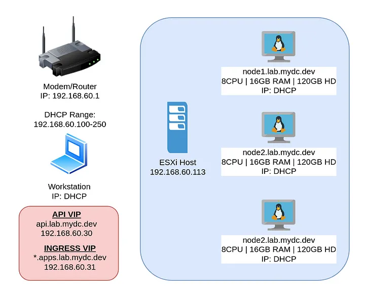
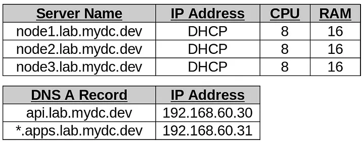
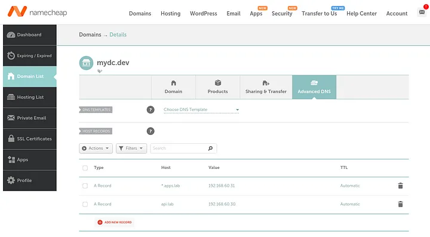
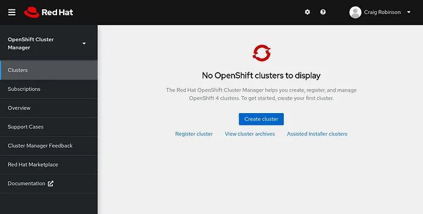

# Deploy 3 node Openshift cluster using assisted installer

This tutorial we will show you how to set up a three-node OCP 12.0 cluster as an example using the assisted installer. All three nodes are assigned master and worker roles. This configuration method does not require a local DNS server, load balancing, or dedicated boot. Alternatively, we will use the public DNS, VRRP, when the installer reconfigures the boot node as our third master node.

## Network Layout:

## Setup DNS:
This guide will use public DNS instead of using or configuring a local DNS server. The name mydc.dev and DNS records in this example are updated from the NameCheap dashboard. The two IP addresses selected for the virtual IP are outside the DHCP range and are not currently used on my network (192.168.60.30 and 31). The cluster name is example “lab”.

Add “A Records” for both api.<clustername>.<domainname> and *.apps.<clustername>.<domainname>

## Login to cloud.redhat.com:
Go to https://cloud.redhat.com and open OpenShift Cluster Manager.

If you do not have an account, you can register for a free developer account at https://developers.redhat.
com. This will allow you to give the OCP cluster a trial period of 60 days.

## Create the cluster:
Click on Datacenter, and “Create Cluster” below Assisted Installer.

* Download and configure the oc client
* Setup an authentication provider using htpasswd

## Download the oc client:
Browse to https://mirror.openshift.com/pub/openshift-v4/x86_64/clients/ocp/stable/ and download the client appropriate for your system.

For Linux clients, wget the client tar file, extract the client tar file, and move the kubectl and oc executables to /usr/local/bin:

wget https://mirror.openshift.com/pub/openshift-v4/x86_64/clients/ocp/stable/openshift-client-linux.tar.gz
tar -zxvf openshift-client-linux.tar.gz
sudo mv kubectl/usr/local/bin/

## Test the oc client:
Download the kubeconfig for your cluster from cloud.redhat.com:

Set the KUBECONFIG environment variable and test the connection:

export KUBECONFIG=~/Downloads/kubeconfig

oc get nodes

## Setup an authentication provider using htpasswd:
The kubeadmin user is not permanent, you need to set another authentication method. The easiest way to set up a local user is to use htpasswd. Create users.htpasswd for testuser with the following command:

htpasswd -c -B users.htpasswd testuser
Create a secret in the openshift-config project using the users.htpasswd file you generated:

